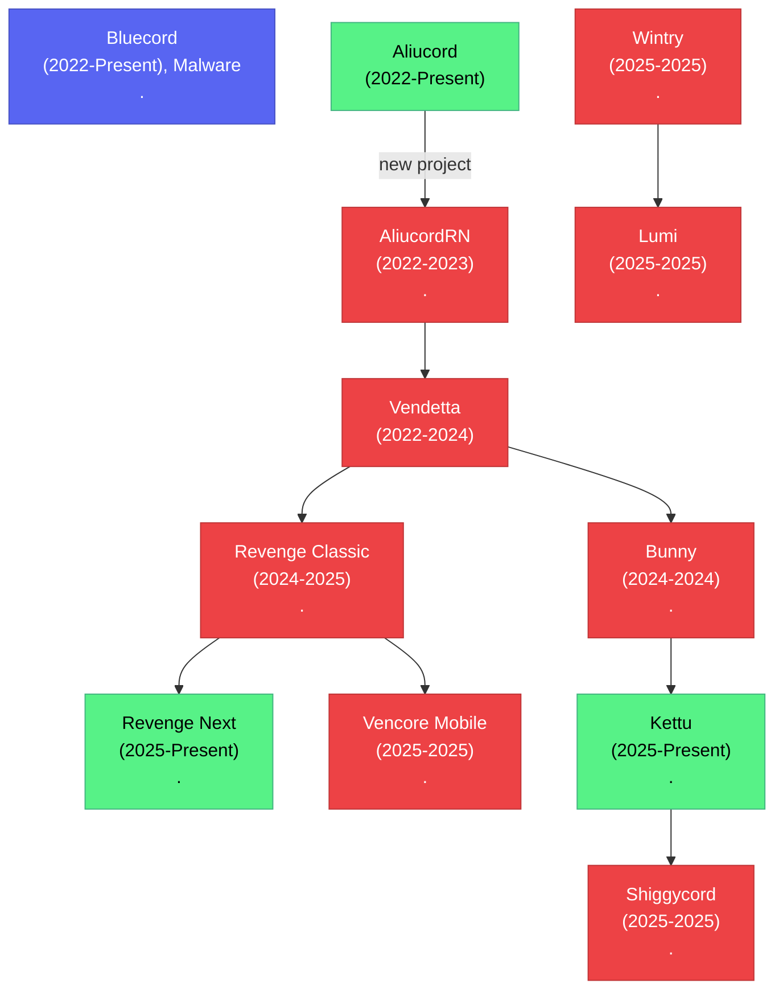

# Lore of mobile client mods for Discord

```mermaid
graph TD
    Z["Bluecord<br/>(2022-Present), Malware<br/> ."]
    A["Aliucord<br/>(2022-Present)"] -->|new project| B["AliucordRN<br/>(2022-2023)<br/> ."]
    B --> C["Vendetta<br/>(2022-2024)"<br/>]
    C --> D["Bunny<br/>(2024-2024)<br/> ."]
    C --> E["Revenge Classic<br/>(2024-2025)<br/> ."]
    E --> F["Revenge Next<br/>(2025-Present)<br/> ."]
    E --> G["Vencore Mobile<br/>(2025-2025)<br/> ."]
    D --> H["Kettu<br/>(2025-Present)<br/> ."]
    I["Wintry<br/>(2025-2025)<br/> ."]
    I --> J["Lumi<br/>(2025-2025)<br/> ."]
    H --> K["Shiggycord<br/>(2025-2025)<br/> ."]

    style B fill:#ED4245,stroke:#C03537,color:#fff
    style C fill:#ED4245,stroke:#C03537,color:#fff
    style D fill:#ED4245,stroke:#C03537,color:#fff
    style G fill:#ED4245,stroke:#C03537,color:#fff
    style J fill:#ED4245,stroke:#C03537,color:#fff
    style I fill:#ED4245,stroke:#C03537,color:#fff
    style K fill:#ED4245,stroke:#C03537,color:#fff
    style E fill:#ED4245,stroke:#C03537,color:#fff
    style A fill:#57F287,stroke:#43B581,color:#000
    style H fill:#57F287,stroke:#43B581,color:#000
    style F fill:#57F287,stroke:#43B581,color:#000
    style Z fill:#5865F2,stroke:#4752C4,color:#fff
```

:::tip Legend
- Red - Discontinued
- Green - Active
- Blue - Bluecord
:::