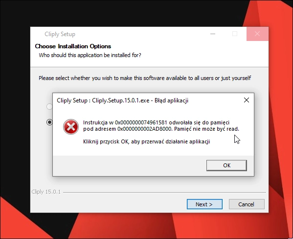
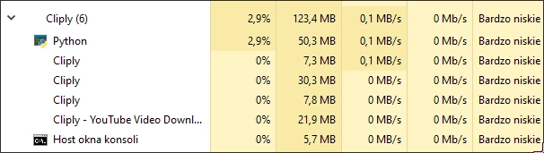

# Exposing Cliply's shadyness
Thanks Masuteri and [Rico404](https://rico040.su/) for discovering this!

## The surprisingly okay homepage
1. It is not said what Cliply even is on their homepage, only a "download just the part you need" slogan, that doesn't really explain anything.


2. After clicking the "Windows" download button, you are shown this page

:::tip Remember
It explicitly says "Built with Transparency", "Just clean, transparent software you can trust" and "Fast. Free. Reliable.", this will be important shortly.
:::

3. Digging into the source code of the site we can see their misconfigured Vercel analitycs failed to load...

I also ran a Wappalyzer scan on the site, not really interesting to be honest.


4. Clicking on the "View on GitHub" link takes us to their GitHub repository, which has only one release and is empty otherwise.

:::tip Take note of:
- The fact that the repository is empty.
- The **only** release is a Windows executable, and marked as "v15.0.1".
- The readme is not properly formatted or even capitalized.
:::

## Unpacking the executable
1. I downloaded the Windows executable, unzipped it using 7zip and started investigating. We can clearly see that it is an Electron app.

2. I extracted the app.asar file and started looking through the code.


## Oh the horrible AI generated code...
1. `src/preload/preload.js` - Has the version set to `1.0.0`, which doesn't match the GitHub release version.

2. `src/main/ipc-handlers.js` - I just laughed at this, WHO PUTS EMOJIS IN THEIR CODE? And the comments don't make any sense... This is clearly vibe-coded.

3. `src/main/index.js` - The AI generated comments are just hilarious at this point.

4. `src/main/services/license-manager.js` - THE FUCKING LICENSE CHECK BEING STORED PLAINLY IN THE CODE!?? WHAT THE FUCK!?? "*BULLETPROOF*", we'll see about that soon.

5. `src/main/services/server-manager.js` - This file tries to install python dependencies right into the user's environment without even asking them, what the fuck...

6. `src/main/renderer/favicon.ico` - They left the default Next.js favicon :sob:

7. `src/main/renderer/api.js` - They left out an API key in there, incomprehensible levels of incompetence.

Hey, at least they didn't give it customer-data permissions!

:::tip They revoked the token
Cliply devs revoked the bearer token as I'm writing this
:::

## Installing the app
1. So, I powered up my Windows 10 LTSC VM and tried installing the app, but for some reason it just killed itself??

2. It didn't when I installed it using my system's default language, Polish. This is weird.
3. And then I found out that it includes a full-on Python runtime, kinda makes sense since it's just a yt-dlp wrapper.

4. Ah, Python, of course...


## Cracking the app
1. I found out that they just store the license information inside `C:/Users/<username>/.config/app-data-7c4f/license/license.json`.

2. You can just edit the license file, to crack everything just change these variables (leave everything else intact):
```json
{
  "isActivated": true,
  "isPro": true,
  "licenseKey": "CLIPLY-NYX:3-MEOW-MEOW",
  "expiresAt": null,
  "activatedAt": "2025-06-30T00:00:00.000Z",
  "lastValidation": "2025-06-30T00:00:00.000Z"
}
```

:::tip License checking
1. The license key can be anything, it just has to start with `CLIPLY-`.
2. The `activatedAt` and `lastValidation` dates can be anything, they just have to be in the future.

:::

3. That's it, you can now use the app (if you even want to, just use yt-dlg or cobalt.tools instead).


## Conclusion
Cliply is a shitty app, that is clearly not built with transparency, but rather with incompetence. The code is a mess, the app is not even properly tested, and the license check is just a joke. The fact that they tried to hide the source code, but couldn't even obfuscate the app.asar file is just sad.  
TLDR: just use YT-DLG or [Cobalt](https://cobalt.tools) instead, they are both open source and have way more features than Cliply.