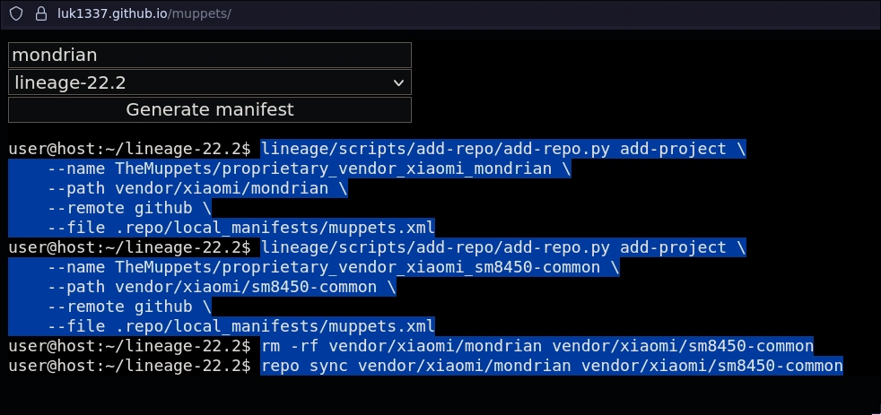

# Adding proprietary blobs to LineageOS sources

So, you just tried to build LineageOS for your device, and you're missing some proprietary blobs, even after using the `extract-files.sh` script. Here's how you can just add them automatically.

1. Get into your source root
```bash
croot
```
2. Go to https://luk1337.github.io/muppets/, type in your device's codename, and click "Generate manifest"

3. Copy these commands, and run them in the terminal
4. Now you can `breakfast` your device again, and it should work as expected
