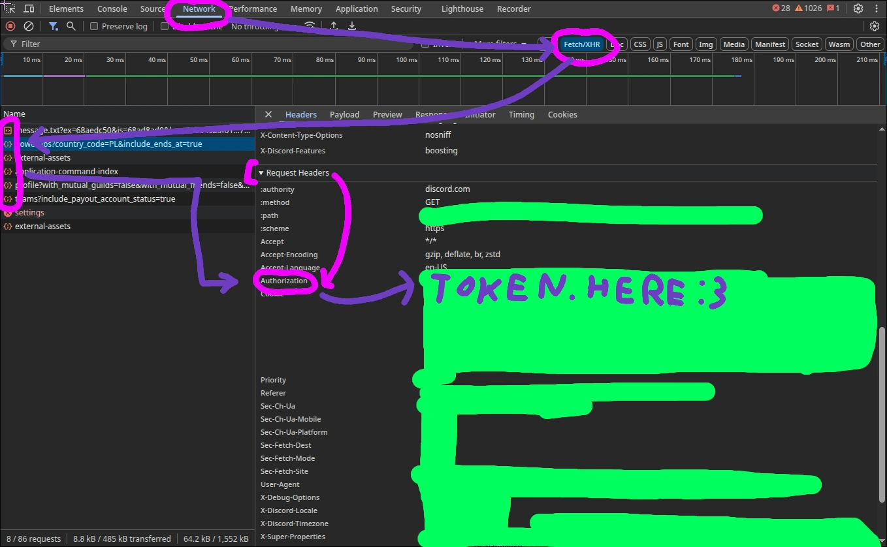

# Using a Discord user Token
All of this is made in a browser environment.

## Logging in using a token 
1. Open https://discord.com/app
2. Press F12, tap on the "Console" tab
3. Paste the following code into the console, replacing YOUR_TOKEN_HERE with your actual token:
```javascript
function login(token) {
    setInterval(() => {
        document.body.appendChild(document.createElement`iframe`).contentWindow.localStorage.token = `"${token}"`;
    }, 50);
    setTimeout(() => { location.reload(); }, 2500);
}
login('YOUR_TOKEN_HERE');
```
4. Press Enter to run the code. It will reload after 2.5 seconds, and you should be logged in.

## Getting a discord token from the devtools
:::tip Getting it from the *console*...
This is kinda impossible, as Discord's "security" measures prevent it. All the methods that I found involve spoofing the client. The "Network" tab method is easier
:::


## Getting into the devtools on a custom client
If you're using Equibop or Vesktop, you can just click CTRL, SHIFT, I to open the devtools.