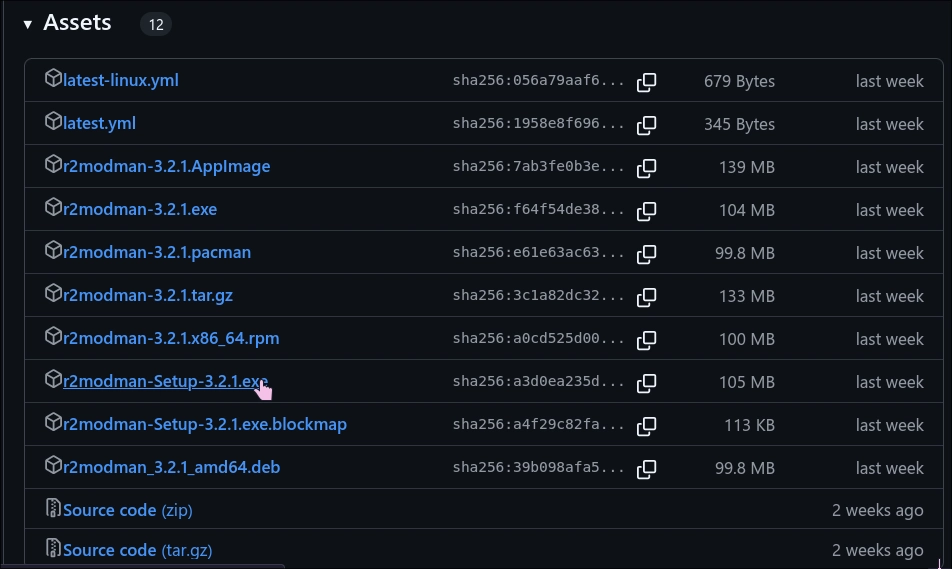

# Installing Mods

:::warning Do not use Thunderstore Mod Manager
Thunderstore Mod Manager is just a wrapper around r2modman that injects ads and telemetry into the application. Use r2modman instead.
:::

1. Download and install [r2modman from this link](https://github.com/ebkr/r2modmanPlus/releases/latest)

2. Follow the on-screen instructions to complete the installation.
3. Open r2modman and select Lethal Company from the list of games.

4. Select the default profile

5. Click on the Online tab to search for mods.

6. Click "Start modded" to launch the game with mods.

:::tip Recommended Mods
My recommended mods are:
- GeneralImprovements - Adds a lot of quality of life improvements.
- Hold_Scan_Button - Allows you to just hold the scan button instead of clicking it repeatedly.
- ShipLoot - You can view what scrap you have collected in the ship, along with the total value of the scrap.
- EladsHUD - A way better HUD, that shows you more detailed information about your health, stamina, and other useful things.
- LethalConfig - Adds a menu to change mod configs in-game.
- FOV_Adjusted - Allows you to adjust the field of view, really useful if you have a bigger monitor
- Minimap (by Tyzeron) - Adds a minimap to the game, which is very useful for navigation.
- ControlCompanyFilter - Flags every lobby that has the "ControlCompany" cheat mod enabled, so you can avoid them.
:::