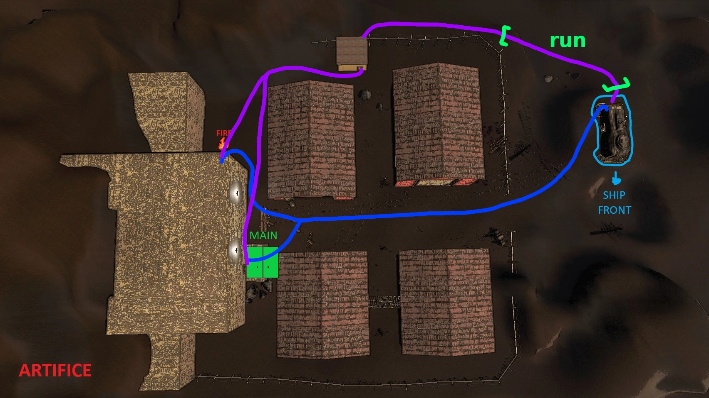
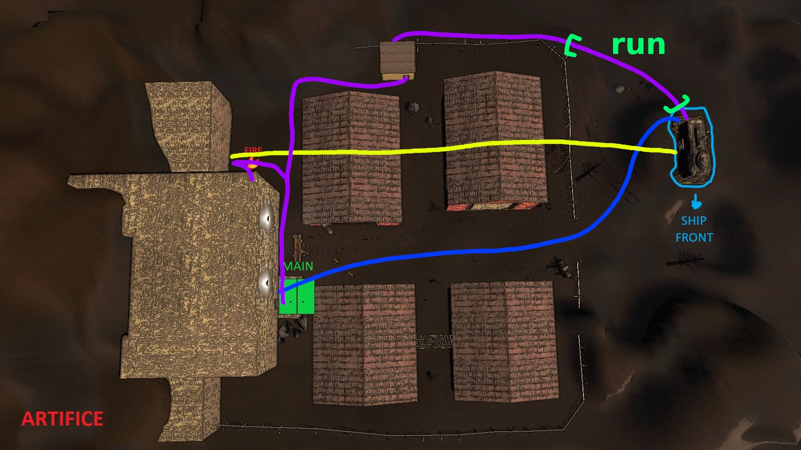
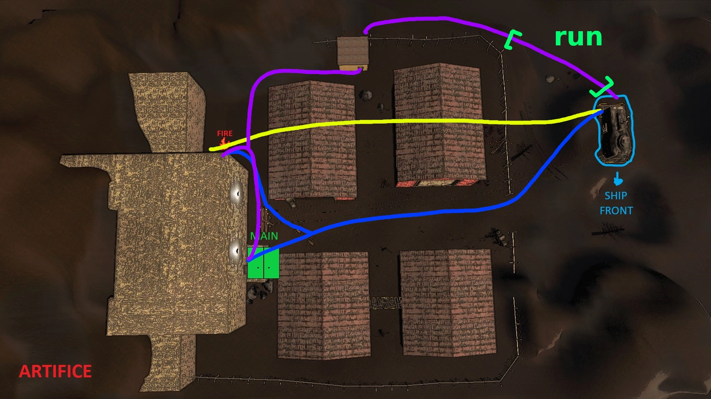

# Artiface

## Vanilla

1. All 4 people run to the Main and Fire exits [blue path], with 2 people going to the Main exit and 2 people going to the Fire exit.
2. Once someone gets at least one two-handed item, they should exit thru their closest exit, run to the ship, drop the items, and then run back to the exit they came from [blue path]. Every team member should do this at least once (unless told otherwise by an item handler).
:::tip Spawning
The map *should* be fairly clear of enemies at the start, old birds almost always begin spawning after ~14:00.
:::
3. After gathering more items, each crew should try to divide the weight of items between themselves. Then follow the [purple path] to the ship, running thru the selected area.

## Company Cruiser

1. Two people prepare the Company Cruiser and execute the Cruiser jump [yellow path], while the other two people run to the Main exit and begin gathering items [blue path]. After the Cruiser jump, the two people who jumped should prepare the Cruiser for the next jump, and go to the Fire exit.
2. Both crews should gather items, dropping them off on top (or inside) the Cruiser [purple path].
3. After it has become too dangerous to gather items, the Fire exit crew should execute the back Cruiser jump [yellow path], while the Main exit crew goes back to the ship [purple path].

## Jetpack

:::tip Amount of Jetpack-capable people
If there is more than one person who can operate the Jetpack, they should split up and go to different exits, but still carry all items to the ship.
:::
1. The Jetpack user should fly to the Fire exit and gather items [yellow path], while the other three people run to both exits, splitting up between the Main and Fire exits [blue path].
2. The Jetpack user should gather items inside, go outside, and then fly to the ship [yellow path], while the other three people gather items and drop them off at the enterence to Main or Fire exits [purple path].
3. After gathering items, the Jetpack user should fly back to the ship [yellow path], while the other three people follow the [purple path] to the ship.