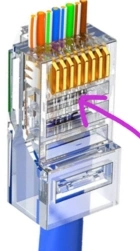
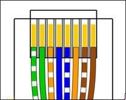
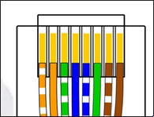

# Ethernet wiring
:::tip TLDR
Ethernet wiring ALWAYS starts with a white-striped color, and it's always in a white/non-white alternating pattern!  
Also, all images are shown from the "bottom" of the cable, do not forget this when wiring your cables.  
:::details Here's how that looks like in comparison

:::

## Type A

- Green-White, Green, Orange-White, Blue, Blue-White, Orange, Brown-White, Brown
- Green, Green, Orange, Blue, Blue, Orange, Brown, Brown

## Type B (more widely used)

- Orange-White, Orange, Green-White, Blue, Blue-White, Green, Brown-White, Brown
- Orange, Orange, Green, Blue, Blue, Green, Brown, Brown

## How tf do I do this!?
It's quite simple really, just follow the color codes, making sure to keep the white-striped ones in the correct order. Here's how i do it:
1. Cut off the cable's isolation, about 3-5cm of it, just to give me some room for error
2. Straighten out the wires, cut off the plastic core and fiber "wire"
3. Arrange the wires according to the color codes for either Type A or Type B
4. Once again straighten out the wires, arranging them in the correct order. You can use a "Crimp Cutter" tool for cutting off the excess wire. There should be ~2.5cm of the small wire
5. Insert the wires into a RJ45 connector, making sure each wire is inserted fully, and that the order is still correct
6. Use a crimping tool to terminate the cable

## Source
- [AnandTech](https://forums.anandtech.com/threads/is-there-a-saying-or-rhyme-to-remember-the-color-order-of-cat-5-cable.784665/)
- [Wikipedia](https://en.wikipedia.org/wiki/TIA/EIA-568)
- [Image at the top](https://kuwait.microless.com/product/taradhin-rj45-pass-through-connectors-100-pack-cat6-rj45-connectors-for-ethernet-cable-cat6-cat5-ends-8p8c-modular-utp-network-plug-gold-plated-lan-network-crimp-rj45-pass-thru/)