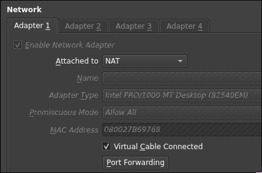
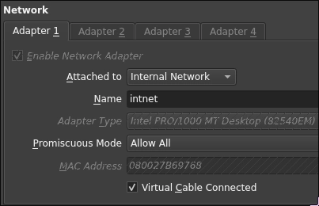

# How to set up a DNS server on Ubuntu Server
This guide will use Bind9 as the DNS server software.
:::tip Software used in this guide
- Nala - A faster frontend for APT
- Bind9 - DNS server software
- Nano - A command line text editor
:::
:::warning Replacement values
- Replace `[INITIALS]` with your initials.
- Replace `[SURNAME]` with your surname.
- Replace `[HOSTNAME]` with the output of the `hostname -f` command.
:::

## Install requirements
:::danger Network adapter settings
Ensure that your **ubuntu server virtual machine** is running on **one network adapter in NAT mode**.

:::
1. Install nala (optional)
```bash
apt install nala
```
2. Install Bind9 and its utilities
```bash
nala install bind9 bind9utils
```

## Configuring the network
:::danger Network adapter settings
Ensure that your **ubuntu server virtual machine** is running on **one network adapter in internal-network mode**, with the promiscuous mode set to Allow All.

:::
1. Configure a static IP address for your server.
```bash
sudo ip addr add 10.80.80.1/24 dev enp0s3
sudo ip link set enp0s3 up
```
2. Verify the IP address
```bash
ip a
```
You should see the IP address `10.80.80.1` assigned to the `enp0s3` adapter.  

3. Edit the hosts file, run `sudo nano /etc/hosts`, then change the first two lines to:
```plaintext
127.0.0.1       localhost
127.0.0.1       [HOSTNAME].[SURNAME].local   [HOSTNAME]
```
4. Stop the systemd-resolved service to prevent conflicts with Bind9.
```bash
sudo systemctl stop systemd-resolved
sudo systemctl disable systemd-resolved
```
5. Edit the resolv.conf file to use the local DNS server. Run `sudo nano /etc/resolv.conf`, remove everything from the file and add:
```plaintext
nameserver 127.0.0.1
search [SURNAME].local
```

## Configuring Bind9
1. Edit the name configuration file. Run `sudo nano /etc/bind/named.conf.options`, erase everything in the file and add:
```plaintext
options {
        directory "/var/cache/bind";
        forwarders {
                10.1.1.30;
        };
        dnssec-validation auto;
        listen-on { any; };
};
```
2. Create a new zone configuration file. Run `sudo nano /etc/bind/named.conf.local`, erase everything in the file and add:
```plaintext
zone "[SURNAME].local" IN {
        type master;
        file "/etc/bind/zones/db.[SURNAME].local";
};
zone "80.80.10.in-addr.arpa" {
        type master;
        file "/etc/bind/zones/db.10.80.80";
};
```
3. Create the IP databases
    1. Run `sudo nano /etc/bind/db.[SURNAME].local` and add:
   ```plaintext
    $TTL    604800
    @       IN      SOA     [HOSTNAME].[SURNAME].local. root.[SURNAME].local. (
                                2         ; Serial
                            604800         ; Refresh
                            86400         ; Retry
                            2419200         ; Expire
                            604800 )       ; Negative Cache TTL
    ;
    @       IN      NS      [HOSTNAME].[SURNAME].local.
    [HOSTNAME]   IN      A       10.80.80.1
    ```
    2. Run `sudo nano /etc/bind/db.10.80.80` and add:
    ```plaintext
    $TTL    604800
    @       IN      SOA     [SURNAME].local. root.[SURNAME].local. (
                                1         ; Serial
                            604800         ; Refresh
                            86400         ; Retry
                            2419200         ; Expire
                            604800 )       ; Negative Cache TTL
    ;
    @       IN      NS      [HOSTNAME].[SURNAME].local.
    10.80.80.1       IN      PTR     [HOSTNAME].[SURNAME].local.
    ```

## Check the configuration locally
1. Check the Bind9 configuration for errors
```bash
sudo named-checkconf
```
If there are no errors, the command will return nothing.
2. Check the zone files for errors
```bash
sudo named-checkzone [SURNAME].local /etc/bind/db.[SURNAME].local
sudo named-checkzone 80.80.10.in-addr.arpa /etc/bind/db.10.80.80
```
If there are no errors, the command will return something like:
```plaintext
zone [SURNAME].local/IN: loaded serial 2
OK
zone 80.80.10.in-addr.arpa/IN: loaded serial 2
OK
```
3. Restart Bind9 to apply the changes
```bash
sudo systemctl restart bind9
```
4. Check the status of Bind9 to ensure it is running
```bash
sudo systemctl status bind9
```
You should see `active (running)` in green text.

## Testing the DNS server
1. Ubuntu server
    1. Test the DNS server using `dig`
    ```bash
    dig [HOSTNAME].[SURNAME].local
    ```
2. Windows client
    1. Go to the network adapter settings in virtualbox settings for the machine, make sure there is only ONE adapter set to internal network, with the promiscuous mode set to Allow All.  
      
    2. After that is done, power on the machine, open the control panel, go to Network and Internet > Network and Sharing Center > Change adapter settings, right click on the network adapter and select properties. Select `Internet Protocol Version 4 (TCP/IPv4)` and click properties. Set the preferred DNS server to `10.80.80.1`.
    3. Open a command prompt and run:
    ```bash
    nslookup [HOSTNAME].[SURNAME].local
    ```

Done! You have successfully set up a DNS server on Ubuntu Server using Bind9.